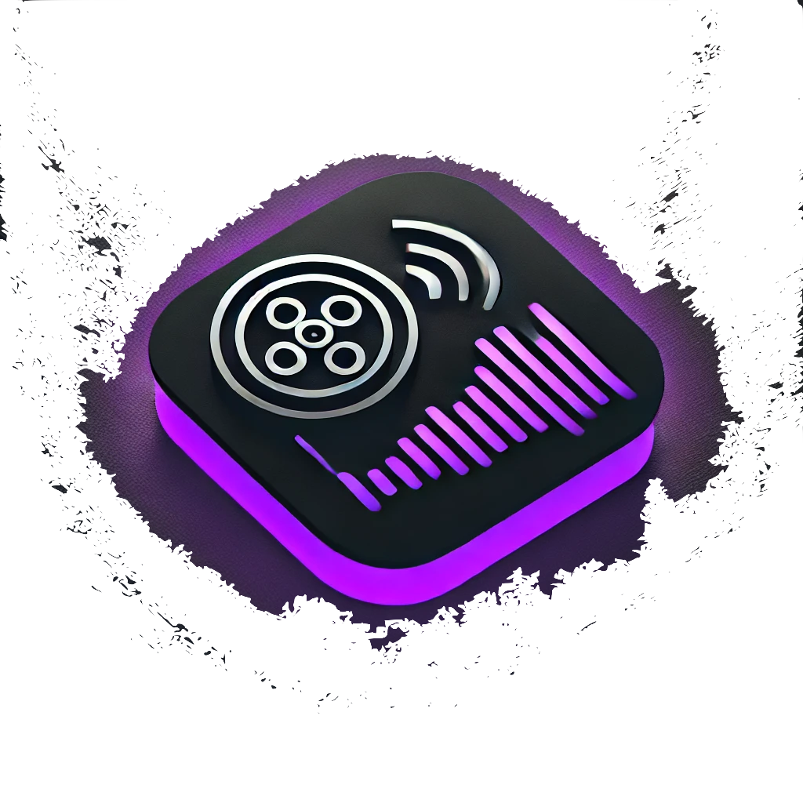

# MediaFlow(HarmoniX)

## Description
MediaFlow (HarmoniX) est une application multimédia développée en C utilisant GTK pour créer une interface graphique moderne. Le projet permet d'ajouter des fonctionnalités de lecture audio/vidéo avec des boutons interactifs.

## Instructions de compilation
1. Assurez-vous que **GTK 3** est installé sur votre système.
2. Clonez ce dépôt et accédez au répertoire du projet :

------------------------------------------------------------------------------------------------------------

gcc `pkg-config --cflags gtk+-3.0 gstreamer-1.0` -Iinclude -o harmonix src/main.c src/ui.c `pkg-config --libs gtk+-3.0 gstreamer-1.0`

Puis

./harmonix
